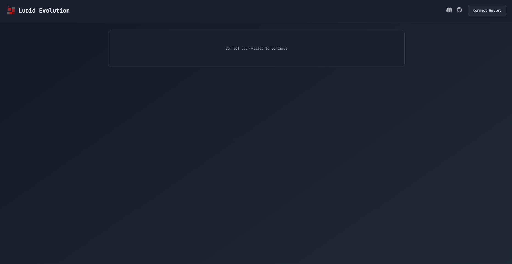
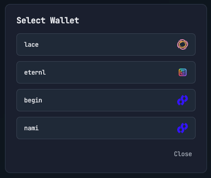
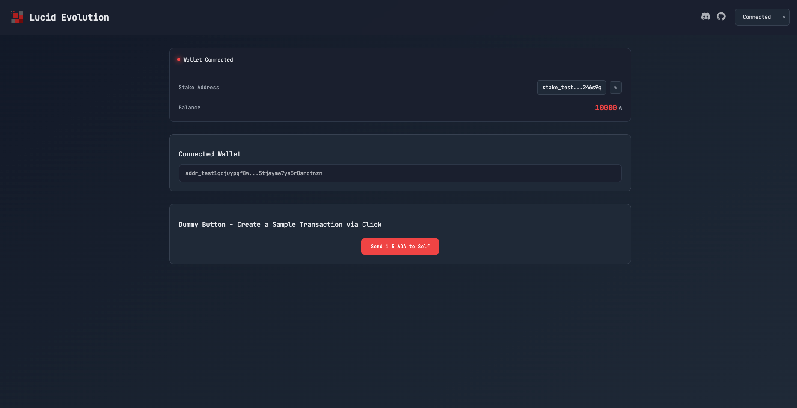

# Turn Classic Client

## TODO
- [ ] remove blockfrost api key from dotenv
- [ ] reformate component system to do less passing values (it will help to make the PreviewNetwork component more hierarchical)


<br/>
<br/>
<br/>
<br/>
<br/>
<br/>
<br/>
<br/>
<br/>
<br/>
<br/>
<br/>
<br/>
<br/>
<br/>
<br/>
<br/>
<br/>
<br/>
<br/>
<br/>
<br/>
<br/>
<br/>
<br/>
<br/>
<br/>
<br/>
<br/>
<br/>
<br/>

# Lucid Evolution Create React App Template

A minimal `Create React App` template for Cardano dApps using Lucid Evolution.

## Prerequisites

1. Get Blockfrost API key from [blockfrost.io](https://blockfrost.io)
2. Create a `.env` file in the project root (`.env.example` file provided for you as a reference):

```bash
REACT_APP_BLOCKFROST_API_KEY=your_blockfrost_api_key_here
```

## User Interface

### Initial Connect Wallet Screen



### Wallet Selection Modal



### Connected Wallet View



### Console - Success log


## Quick Start

1. Go to the example directory:

```bash
cd examples/with-react-cra
```

2. Install dependencies:

```bash
yarn install
```

3. Customize the app by editing `src/config/app.config.ts`

4. Start the development server:

```bash
yarn start
```

5. Open [http://localhost:3000](http://localhost:3000) to view it in the browser.

## Quick Customization

This template is designed to be easily customizable. All app-wide settings are in a single configuration file, modify it to your needs:

```typescript
// src/config/app.config.ts
export const appConfig = {
  title: "Your Project Name", // Change the app title
  logo: {
    path: "/your-logo.png", // Add your logo to public/ folder and update path
    alt: "Your Logo Alt Text",
  },
  socials: {
    discord: "https://discord.gg/your-server", // Your Discord invite
    github: "https://github.com/your-org", // Your GitHub org/repo
  },
};
```

## Project Structure

```
src/
├── components/          # React components
│   ├── ConnectButton.tsx   # Wallet connection button
│   └── WalletConnect.tsx   # Wallet connection modal
├── config/             # Configuration files
│   ├── app.config.ts   # App-wide settings (title, logo, socials)
│   └── theme.ts        # UI theme configuration
├── hooks/              # Custom React hooks
│   └── useWallet.ts    # Wallet and Lucid initialization hook
├── styles/            # Global styles
│   └── globals.css
├── App.tsx           # Main app component
└── index.tsx         # Entry point
```

## Dependencies

- [@lucid-evolution/lucid](https://github.com/Anastasia-Labs/lucid-evolution)
- [@cardano-foundation/cardano-connect-with-wallet](https://github.com/cardano-foundation/cardano-connect-with-wallet)

## Network Support

Currently configured for Preprod testnet. To use on other networks, modify the `NetworkType` in `useWallet.ts` and update the Blockfrost endpoint accordingly.

## Transaction Example & Security

Includes a dummy button that demonstrates transaction handling using a secure approach:

- Transaction Building (Client-Side):

  - Creates an unsigned transaction with specified parameters (amount, addresses)
  - Converts the transaction to CBOR (Concise Binary Object Representation) format

- Wallet Interaction:

  - The unsigned CBOR transaction is passed to the wallet
  - Wallet signs the transaction using CIP-30 standards
  - Private keys never leave the wallet's secure environment
  - Signing is done completely client-side in the user's browser

- Submission:
  - The signed transaction is submitted to the Cardano network
  - Only public information (addresses, amounts) and the signed CBOR are used
  - No sensitive data is ever exposed or transmitted
